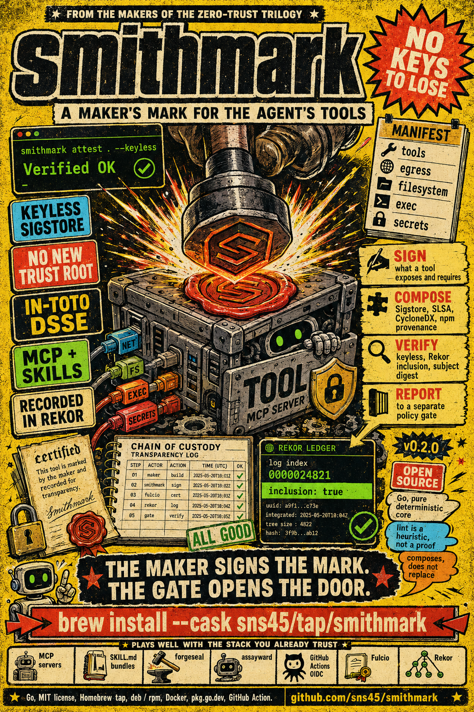

# smithmark

<p align="center">
  
</p>

**Provenance and capability attestation for the agent tool supply chain: signed, verifiable maker's marks for MCP servers and skills.**

smithmark is the smith's mark, the maker's stamp struck on a forged tool. It
generates, signs, publishes, and verifies attestations for the artifacts agents
actually wield: MCP servers and SKILL.md bundles. An MCP server can place phone
calls, read email, and push commits; a skill is arbitrary instructions plus
scripts loaded into a privileged context. Today both are installed the way
containers were in 2015: pulled by name, trusted by reputation. Nothing in the
ecosystem attests who built these artifacts, what they are capable of, or
whether what they declare matches what their code can do. smithmark produces
that missing evidence. A policy engine consumes it.

> Status: v0.2.0, released, with keyless Sigstore signing and verification
> (Fulcio certificate, Rekor transparency log). Two MCP servers publish a
> smithmark attestation on every release; both verify with stock `cosign`,
> Rekor inclusion included.

## What smithmark is

A generator, signer, publisher, and verifier of attestations for agent
artifacts:

1. **Capability manifests.** A signed, schema validated declaration of what an
   MCP server or skill exposes and requires: tools, network egress, filesystem,
   exec, env, and secrets.
2. **Build provenance.** SLSA style provenance for skill bundles and MCP
   packages, composing (not duplicating) npm provenance and Sigstore.
3. **Capability lint.** Heuristic static detection of undeclared capabilities:
   the gap between what the manifest claims and what the code appears able to do.
4. **Verification.** `smithmark verify` resolves an artifact, discovers its
   attestations, verifies signatures and subject digests, and emits a machine
   readable report an external policy engine consumes as evidence.

See the self demonstrating admission demo, captured verbatim, in
[`docs/demo.md`](docs/demo.md). It shows, offline, the capability gap block of a
validly signed but misdeclared MCP server and the admission of a valid one at the
verification core, and the runtime end to end explainable deny and allow through
the Claude Code hook for a signed skill. The same clean capability gap block of
an MCP server driven all the way through the hook offline is honestly not there
yet: verify resolves an mcp-server digest only over the network today, so it
awaits a future pinned bundle or trust root verify path.

## The trust as code family

smithmark is the fourth tool in the trust as code family, and the bridge between
its two hemispheres, the zero trust supply chain trilogy and the agentic tooling
line:

| Tool | Question | Role |
|------|----------|------|
| **forgeseal** | *What* is running? | Attestation producer (containers, packages) |
| **svidmint** | *Who* is running it? | Identity issuer |
| **assayward** | *Whether* to let it run | Policy gate (consumer) |
| **smithmark** | *Who made the agent's tools, and what can they do?* | Attestation producer for agent artifacts |

The trilogy verifies the supply chain. smithmark extends the same discipline to
the tools the agents themselves wield. smithmark produces the missing evidence;
assayward consumes it.

## What is genuinely new here

smithmark's novelty claim is narrow, falsifiable, and demonstrated against named
prior art, per the discipline recorded in
[`docs/research/whitespace-sweep.md`](docs/research/whitespace-sweep.md):

> smithmark is the first attestation framework to cover both MCP servers and
> skills with capability declarations issued as portable, signed attestations
> (in-toto DSSE) for an external policy engine to consume: it composes npm
> provenance, Sigstore, SLSA, and CycloneDX rather than replacing them or minting
> a bespoke trust root, and it closes the loop from publication (maker's mark) to
> admission (assayward policy).

The near neighbors are named in the same breath they are distinguished:

> Enclawed signs skill manifests for its own runtime;
> studiomeyer-io/mcp-server-attestation signs tool and spawn allowlists for MCP
> servers under trust on first use; ETDI binds OAuth scoped tool definitions to a
> client side policy check. None covers both artifact kinds, none composes the
> existing supply chain standards, and none separates the maker's mark from the
> gate that consumes it. Scanners inspect; registries curate; the near neighbors
> sign in silos; smithmark composes.

This is a composition claim, not a greenfield one. Each primitive (a signed
manifest, a capability vocabulary, a policy gate) exists separately in prior
work; the novelty is the composite, and it remains falsifiable: a single prior
framework shown to cover both artifact kinds, compose the four standards through
a portable predicate, and feed an external admission gate would falsify it. The
sweep of fourteen swept items found none.

## Composition, never a parallel trust root

smithmark is additive evidence. It composes the supply chain roots that already
exist rather than minting its own:

- **npm provenance.** Where present, npm provenance is a Sigstore backed SLSA
  predicate naming the source repository, commit, build workflow, and artifact
  digest. It proves build origin; it never states what a package can do at
  runtime. `smithmark verify` checks npm's own provenance where present *and*
  smithmark's capability attestation, and the report distinguishes the two. A
  package with perfect provenance can still open arbitrary sockets and read
  arbitrary files; smithmark adds the layer provenance cannot express.
- **Sigstore.** DSSE signing, bundle and Rekor verification, keyless issuance via
  Fulcio and OIDC. smithmark reuses `sigstore-go`; it hand rolls no crypto.
- **SLSA.** Build provenance levels applied to agent artifacts, composed from
  forgeseal rather than reimplemented.
- **CycloneDX.** The capability declaration projects into a CycloneDX property
  taxonomy (`in8:agent:capability:*`), the standards facing mapping kept in
  lockstep with the in-toto predicate.

The primary envelope is an in-toto DSSE predicate,
`https://in8.sh/attestation/agent-capability/v1`. smithmark is never a parallel
trust root; it rides the infrastructure that already exists so the maker signs
once and any gate anywhere can verify.

## Commands

The maker facing CLI generates, signs, and verifies capability attestations, and
scaffolds the declaration a maker authors. Flags shown are the real v0.1 surface.

```
smithmark attest <path>            # generate and sign a capability attestation
smithmark verify <artifact>        # verify an attestation and emit a report
smithmark lint <path>              # statically scan sources for undeclared capabilities
smithmark registry check <name>    # inspect an MCP Registry entry's attestation posture
smithmark manifest init            # scaffold a smithmark.yaml declaration
```

- **`smithmark attest <path>`** reads the artifact kind from the `smithmark.yaml`
  at that path: a skill is bundled and digested from its directory, an mcp-server
  is digested from its npm tarball and has its tool listing extracted from the
  running server (or read with `--tools-from`). It composes a forgeseal
  dependency SBOM, wraps the manifest in DSSE, and signs it. Key flags:
  `--key` (a PEM private key for offline signing), `--tools-from`, `--tarball`,
  `--attestation-base`, `--output` (write the bundle to a file instead of
  pushing), `--skip-sbom`, `--dry-run`.
- **`smithmark verify <artifact>`** accepts an npm `name@version`, a local
  artifact directory, an OCI reference, or, with `--bundle`, an explicit bundle
  file. It discovers candidate attestations, verifies their DSSE signatures
  against `--trust-root` (a PEM public key), validates the manifest, and prints a
  classified report (`--output summary|json`). Exit code is 0 when every failing
  class check passes, 1 when any fails, 2 when a passing verification is flagged
  under `--strict` for an `UNDECLARED_` finding, and 3 on an operational failure.
- **`smithmark lint <path>`** scans a source tree for capabilities its
  `smithmark.yaml` does not cover and reports each as an `UNDECLARED_` finding.
  It never executes the artifact. Findings are advisory: lint always exits 0
  unless an operational error prevents the scan.
- **`smithmark registry check <server-name>`** fetches an MCP Registry entry and
  reports whether it carries the attestation reference field the registry
  provenance RFC proposes (no real entry does today, which is the gap the command
  demonstrates), then verifies the entry's npm package when it has one.
- **`smithmark manifest init`** writes a `smithmark.yaml` from flags (`--kind`,
  `--name`, `--source`, `--version`, and repeatable `--egress`, `--fs`, `--exec`,
  `--env`, `--secret`, `--transport`, `--invokes-tool`). v0.1 is flag driven; an
  interactive TTY mode is deferred.

## A worked round trip

A skill, attested and verified end to end offline. Every command below is the
real v0.1 surface, run from a directory that contains a `greeter/` skill with a
`SKILL.md`:

```
# 1. Scaffold the capability declaration next to the skill's SKILL.md
smithmark manifest init --kind skill --name greeter --source local \
  --exec echo --env GREETER_NAME --out greeter/smithmark.yaml

# 2. Generate a signing keypair (any P256 ECDSA key works for offline signing)
openssl ecparam -name prime256v1 -genkey -noout -out key.pem
openssl ec -in key.pem -pubout -out key.pub.pem

# 3. Attest the skill directory: bundle and digest it, sign it key based,
#    and write the signed bundle to a file instead of pushing it
smithmark attest ./greeter --key key.pem --skip-sbom --output greeter.sigstore.json

# 4. Verify the bundle against the matching public key and print a report
smithmark verify ./greeter --bundle greeter.sigstore.json \
  --trust-root key.pub.pem --output summary

# 5. Statically scan the sources for capabilities the declaration does not cover
smithmark lint ./greeter
```

Step 4 prints a classified report ending in `VERIFIED greeter` and exits 0; the
informational lines (Rekor inclusion, npm provenance) report as not attempted for
a key based offline bundle, by design. Step 5 exits 0 with no findings when the
declaration covers what the code does. An mcp-server follows the same shape, with
its subject digest taken from the npm tarball (`--tarball`) and its tool listing
extracted from the running server or read with `--tools-from`. The full admission
demo, including a misdeclared server blocked on its capability gap, is in
[`docs/demo.md`](docs/demo.md).

## Surfaces

- **GitHub Action** ([`action/`](action/)): run `smithmark verify` against an
  agent tool artifact as a supply chain check in CI.
- **Claude Code hook** ([`surfaces/claude-code-hook/`](surfaces/claude-code-hook/)):
  the reference runtime shim, a `PreToolUse` hook that gates MCP tool calls
  behind `smithmark verify` and returns an explainable allow or deny. Its offline
  suite demonstrates the end to end block, naming the undeclared capability, and
  the allow for a signed skill; the same clean capability gap block of a
  misdeclared MCP server through the hook offline awaits a future pinned bundle verify path, since
  verify resolves an mcp-server digest only over the network today (see
  [`docs/demo.md`](docs/demo.md)). One shim, well documented; the pattern
  generalizes, the repo does not chase every runtime.
- **Example assayward policies** ([`policies/`](policies/)): `TrustPolicy`
  documents showing the separation the design insists on. smithmark is not a
  policy engine; it hands assayward an Evidence block, and the allow, deny, or
  audit decision is entirely assayward's.

## Standards proposals

The standards deliverable is a first class artifact, not an afterthought. Two
proposal drafts live in repo and version with the reference implementation:

- **CycloneDX agent capability taxonomy**
  ([`proposals/cyclonedx-agent-capability/`](proposals/cyclonedx-agent-capability/)):
  a property namespace and taxonomy targeted at Ecma TC54 / CycloneDX.
- **MCP Registry provenance RFC**
  ([`proposals/mcp-registry-provenance/`](proposals/mcp-registry-provenance/)):
  attestation reference fields on registry entries plus verify on publish,
  targeted at `modelcontextprotocol/registry`.

The tool is the reference implementation of the proposals, not the other way
around: every property in the taxonomy is a projection of a field smithmark
already emits, signs, and verifies.

## Install

Release engineering follows the family: GoReleaser, a Homebrew tap, deb and rpm
via nfpm, a Docker image, and pkg.go.dev. smithmark publishes to the tap as a
Cask (decision D8), because GoReleaser deprecated the `brews` block for prebuilt
binaries:

```
brew install --cask sns45/tap/smithmark
```

Or install the CLI directly with Go:

```
go install github.com/sns45/smithmark/cmd/smithmark@v0.2.0
```

To build from source:

```
go build -o smithmark ./cmd/smithmark
```

## Honest scope and deferrals

A launch that overclaims is worse than one that is precise. What smithmark does
not do yet, on the record, as of v0.2.0:

- **npm's own provenance is not cryptographically verified.** smithmark verifies
  its own attestations in both trust modes: keyless (Fulcio certificate, Rekor
  transparency log, with the certificate identity and OIDC issuer enforced by
  exact match) and key based offline (a PEM public key named by `--trust-root`).
  Verifying npm's own SLSA provenance attestation is a separate concern and stays
  out of scope; `NPM_PROVENANCE_VERIFIED` reports as not attempted.
- **The CLI is not an agent artifact the capability model represents.** smithmark
  ships as a Go binary. The v0.1 capability manifest model defines only the
  `mcp-server` and `skill` kinds; a CLI or binary kind does not exist, so
  smithmark does not fabricate a manifest for itself. Its own release is instead
  attested by what genuinely applies to a binary: a forgeseal dependency SBOM and
  SLSA provenance, keyless Sigstore signing in CI, and an assayward gate over the
  published release (decision U9).
- **Lint is heuristic and advisory, not sound.** Capability lint detects obvious
  undeclared capabilities by matching literal source text; it never executes the
  artifact and it does not prove the absence of a capability. Dynamic import,
  `eval`, and similar constructs are known, tested false negatives. It is a
  signal for policy, not a guarantee.
- **Lint findings reach assayward, but the gate does not yet decide on them.**
  The cross repo Evidence widening ([sns45/assayward#1](https://github.com/sns45/assayward/issues/1))
  landed in assayward v0.2.0, which smithmark now pins: the kind tagged
  `ArtifactRef`, an explicit `schemaVersion`, and carried lint findings are all in
  the Evidence smithmark hands over. Writing policy that gates on those findings
  is the adopter's call, not something smithmark decides.

## License

See [LICENSE](LICENSE).
